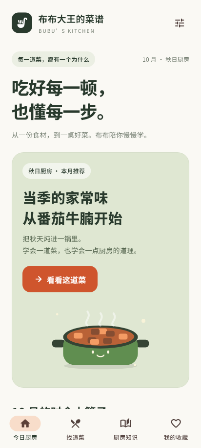
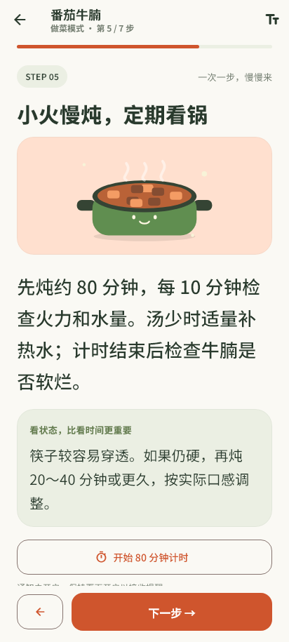

# V1 验证记录

日期：2026-10-01（北京时间）。

## 已通过

- `flutter analyze`：无问题。
- `flutter test --reporter expanded`：8 项测试全部通过。
- 自动验证：月份推荐、知识引用、人数换算、收藏和进度持久化、计时恢复、暂停/继续、计时去重、完成清理。
- 界面测试：360、412、1100 像素宽度，首页、详情、备料、超大字号做菜步骤无溢出；滚动后切换步骤回到页面开头。
- 本机浏览器：菜谱详情、3 人份食材换算、菜谱收藏、全部备料勾选、知识卡及知识收藏、启动计时、暂停计时、切换步骤。
- 重新打开预览：第 3 步恢复，暂停的计时仍为 02:23，未继续扣秒。
- 完整流程：逐步到第 7 步，确认关火后显示完成页，返回首页后本次进度与计时清空。
- `flutter build web --release --no-web-resources-cdn`：成功；渲染资源与中文字体打包在本机。
- `flutter build apk --release`：成功，APK 61,804,212 字节。
- `apksigner verify --verbose`：验证通过，APK Signature Scheme v2，有 1 个签名者。
- `aapt dump badging`：包名 `com.bubu.bubu_kitchen`，版本 `1.0.0`，最低 API 24，目标 API 36；含 arm64-v8a、armeabi-v7a、x86_64。
- 中文应用名称与原创图标已配置；字体授权文件包含在源码中。

安装包 SHA-256：`873009744A86F56534ECCD266BDFA00466D7B6D7356C4C61DEC8974A0C70730C`。

## 需要在你的安卓手机上确认

当前电脑未连接安卓设备，以下系统能力已实现并通过编译，尚未经真实手机实测：

1. 做菜页保持常亮，退出做菜页后恢复系统正常熄屏；切换常亮开关立即生效。
2. 允许通知后，短计时到时收到系统通知；拒绝权限仍能在做菜页使用计时。
3. 开启精确计时权限后，锁屏或切到其他应用时收到到时提醒。
4. 进入慢炖步骤启动计时，10 分钟收到看锅提醒；结束做菜后不再提醒。
5. 切换到后台再回到前台，计时按实际经过时间更新。
6. 设备重启后，重新打开 APP，恢复尚未结束的计时；强行停止应用期间通知受安卓系统限制。

体验时不需要开火，可以用焯水的 3 分钟计时检查通知。手机静音、省电和厂商后台限制会影响通知声音与时间。

这是开发签名体验版，未上架应用商店。页面验证中的完成次数为模拟操作，安卓版首次安装从空记录开始。

## 界面图

手机尺寸截图由真实 Flutter 渲染导出，尺寸 412×915，非设计稿：

